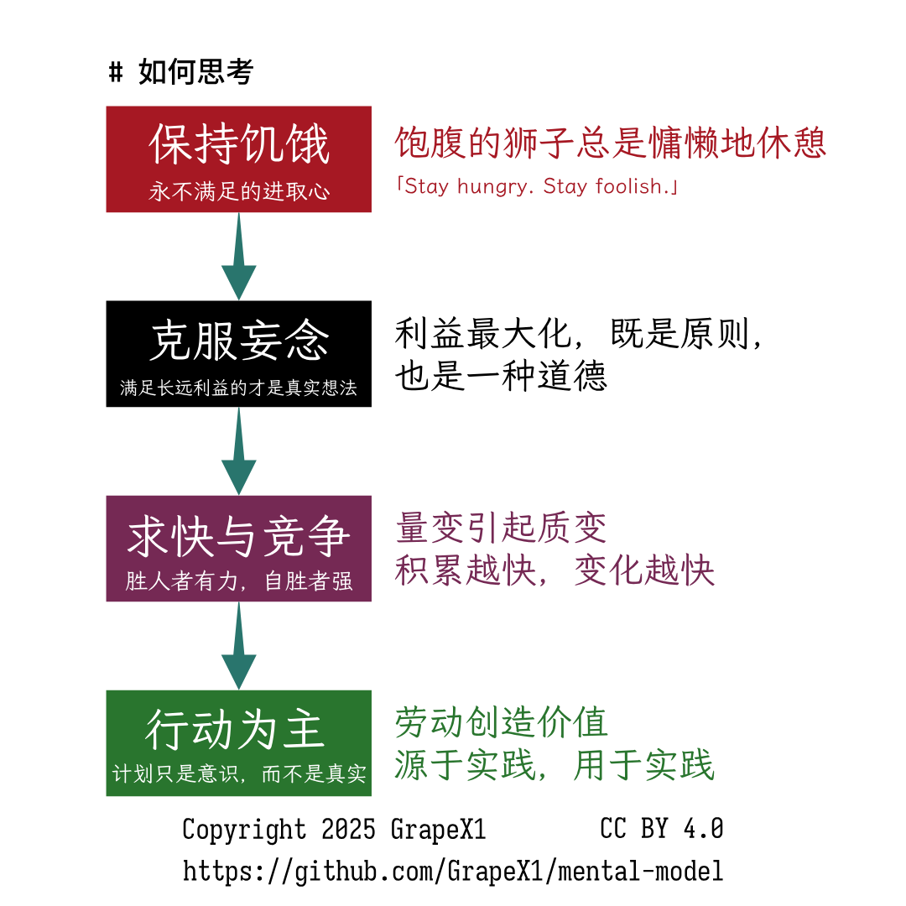
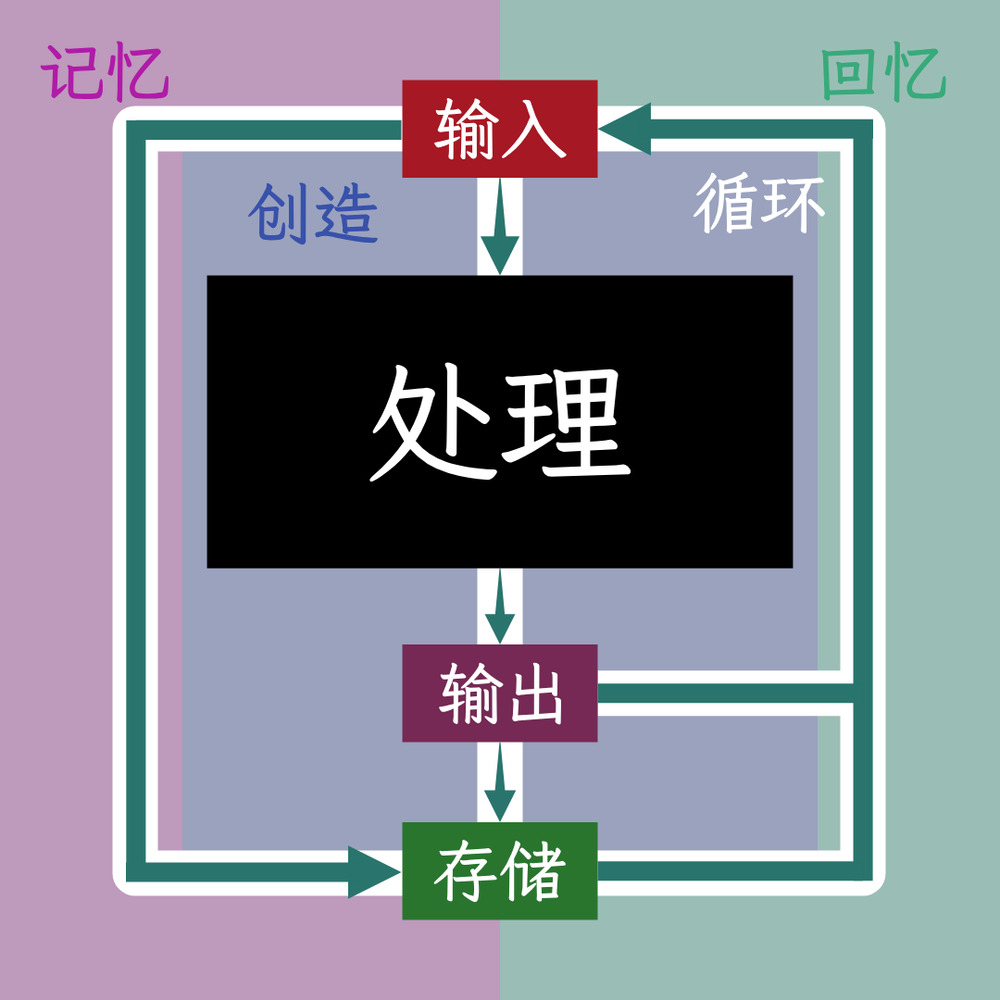
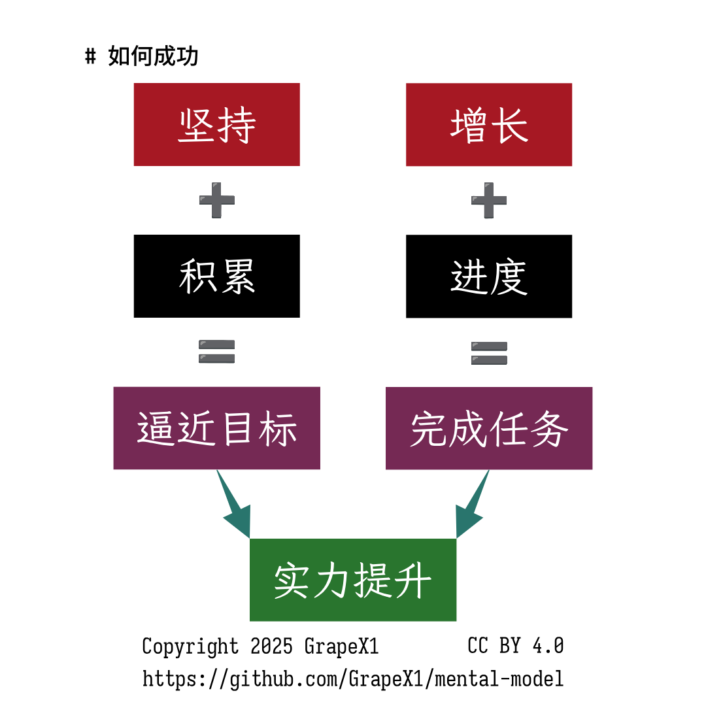

# GrapeX1 心智模型

## 心智模型是什么

心智模型（Mental model）是一种心理工具，涉及思维和知觉等方面。它能帮助人们认识、思考和应对世界上的各种现象。

就像用数学公式得出正确的运算结果，通常用心智模型是希望得到合理的认知结果和对应的方法论。

## 作品

### 如何思考

### 信息循环

### 如何成功

### 分析自由

### 生命枷锁

## 版权许可

Copyright © 2025 GrapeX1

[本仓库](https://github.com/GrapeX1/mental-model)中的文档、图片作品使用 [Creative Commons Attribution 4.0 International License](https://creativecommons.org/licenses/by/4.0/) 授权。
