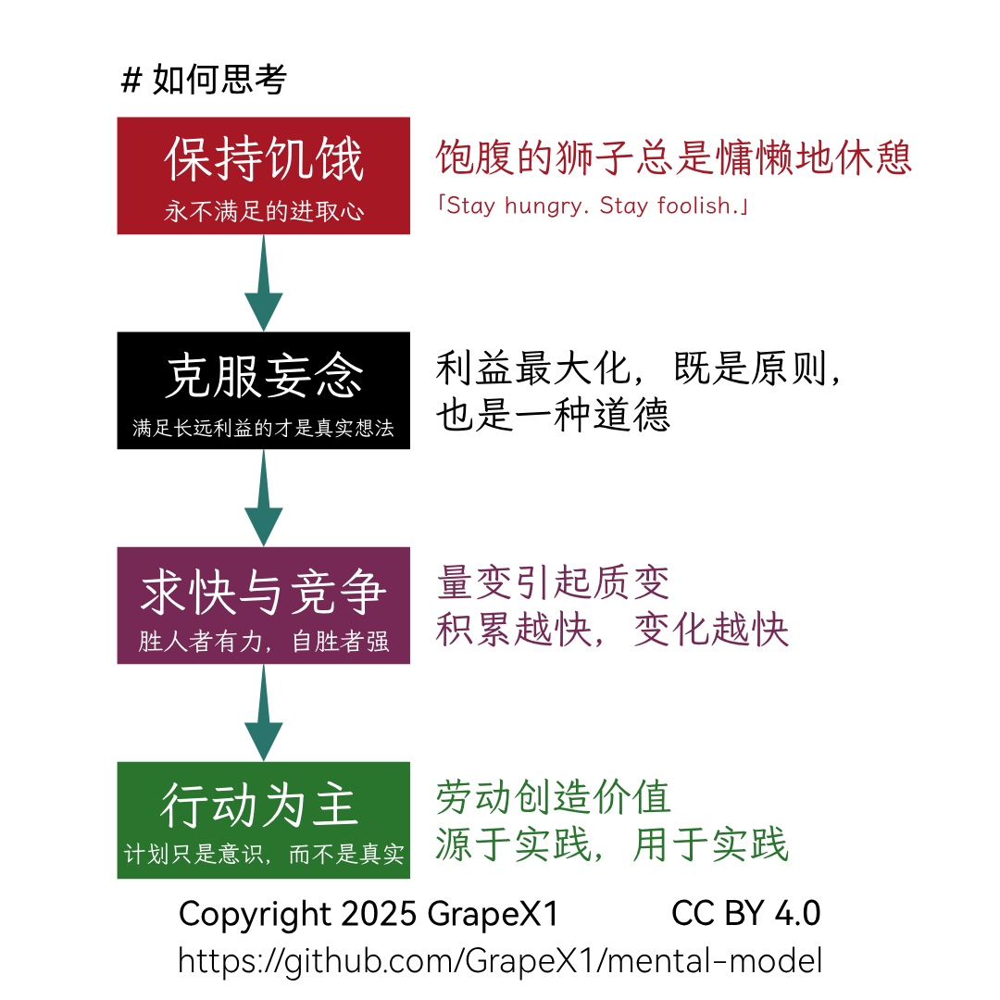
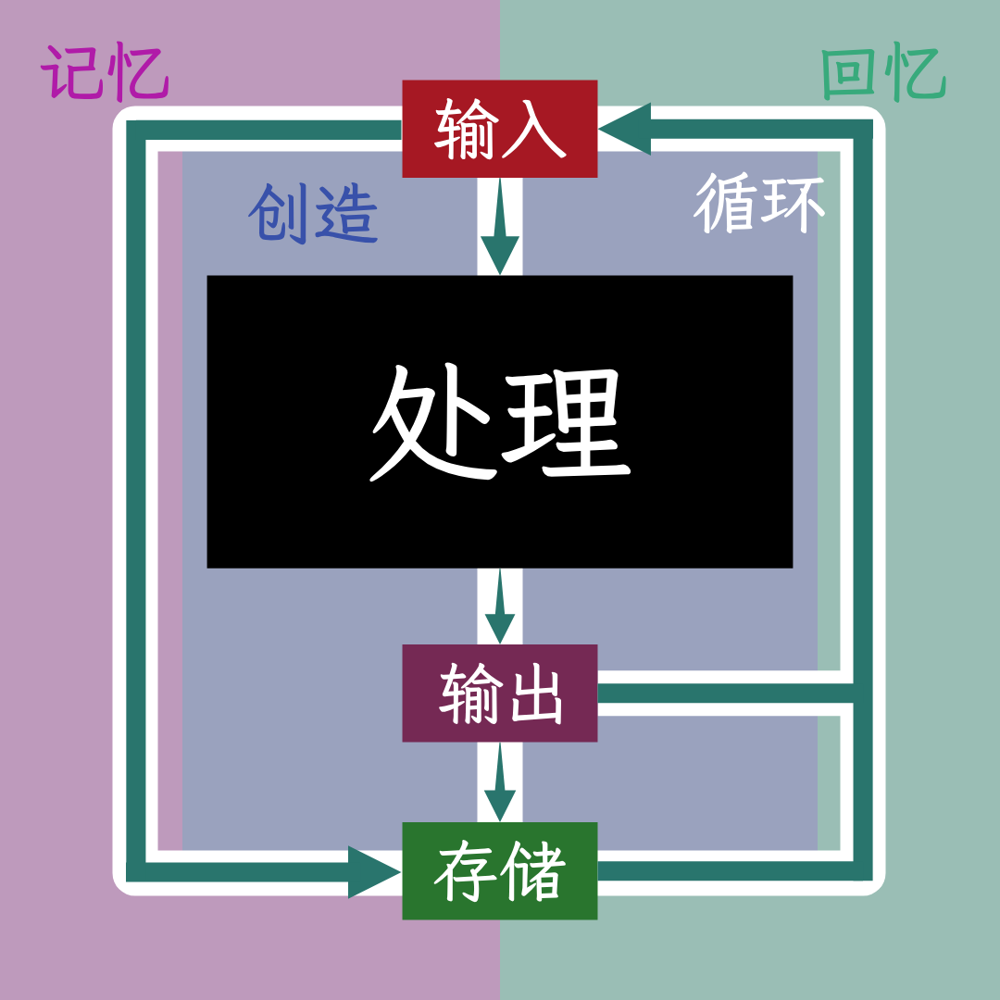

# 心智模型

心智模型（Mental model）是一种心理工具，涉及思维和知觉等方面。它能帮助人们认识、思考和应对世界上的各种现象。

就像用数学公式得出正确的运算结果，通常用心智模型是希望得到合理的认知结果和对应的方法论。

## GrapeX1 心智模型

### 如何思考

### 信息循环

## License

Works in [this repository](https://github.com/GrapeX1/mental-model) are licensed under [CC BY 4.0](https://creativecommons.org/licenses/by/4.0/)
